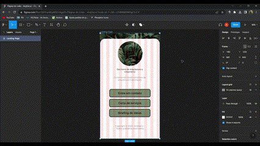

<h1>Página de Links - ArqDecor - Escritório de Arquitetura e Design</h1>

Este repositório foi desenvolvido para armazenar o projeto criado para um escritório de Arquitetura e Design, ArqDecor.

<h2>Resumo do Projeto</h2>

A ideia de criar uma página de links para o Escritório partiu de uma iniciativa de ambas as partes no intuito de prospectar mais clientes através das redes sociais.

Atualmente, muitas empresas e escritórios já utilizam as redes sociais para criar conteúdo e desenvolver um contato mais direto e humanizado com seus clientes e utilizar uma página de links personalizada é um ótimo diferencial para se destacar no mercado.

<h2>Design do Projeto</h2>

O design do projeto foi totalmente desenvolvido utilizando as ferramentas disponibilizadas pelo <strong>figma</strong>, desde o layout moderno e limpo até a disposição dos ítens utilizando conceitos de design avançado como grid-mobile (10 colunas vertical - 5 colunas horizontal).

<h2>Softskills Desenvolvidas</h2>
<ul>
    <li>Organização e versionamento de Código</li>
    <li>Criação de projeto do zero ao lançamento</li>
    <li>Utilização funcional de Branchs do github</li>
    <li>Desenvolvimento de layout moderno</li>
    <li>Conversação e ajustes junto ao cliente</li>
</ul>
<h2>Tecnologias Utilizadas</h2>

    
    
    
    
    
    

<h2>Protótipo</h2>

Acesse o protótipo no figma através deste <a href='https://www.figma.com/file/cYjVYcwnKrpMSEnVgpjf1r/P%C3%A1gina-de-Links---ArqDecor?t=vURUqt857VEizeLs-0'>link</a>.

<h2>Versão Final</h2>

Acesse Versão final do projeto desenvolvido através deste <a href='#'>link</a>.

